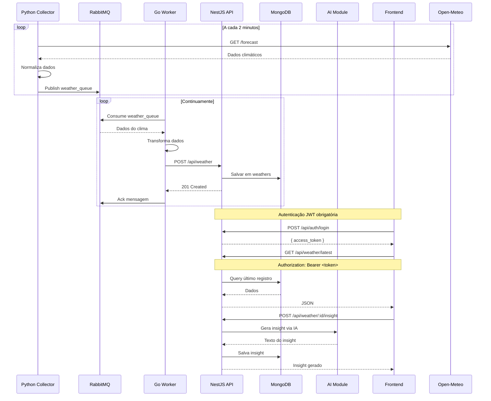

## Arquitetura do Sistema

```mermaid
graph TB
    subgraph Coleta
        A[Python Collector] -->|Publish JSON| B[RabbitMQ]
        G[Open-Meteo API] -->|HTTP GET| A
    end

    subgraph Processamento
        B -->|Consume| C[Go Worker]
        C -->|HTTP POST| D[NestJS API]
    end

    subgraph Armazenamento
        D -->|Mongoose| E[(MongoDB Atlas)]
    end

    subgraph IA
        D -->|HTTP| H[AI Module<br/>Gemini/OpenAI]
        H -->|Insights| D
    end

    subgraph Frontend
        F[React + Vite<br/>Nginx] -->|REST + JWT| D
    end

    subgraph Seguranca
        I[JWT Strategy<br/>Passport.js]
        J[CORS Whitelist]
        K[AuthGuard<br/>@UseGuards]
    end

    D --> I
    D --> J
    D --> K

    style A fill:#3776ab,stroke:#fff,color:#fff
    style B fill:#ff6600,stroke:#fff,color:#fff
    style C fill:#00add8,stroke:#fff,color:#fff
    style D fill:#e0234e,stroke:#fff,color:#fff
    style E fill:#47a248,stroke:#fff,color:#fff
    style F fill:#61dafb,stroke:#333,color:#333
    style G fill:#8B4513,stroke:#fff,color:#fff
    style H fill:#9B59B6,stroke:#fff,color:#fff
```

### Fluxo de Dados



### Decisões Técnicas

| Decisão | Alternativa | Por que escolhemos |
|---------|-------------|-------------------|
| **Go para worker** | Node.js, Python | Performance, concorrência nativa, binário único |
| **RabbitMQ** | Redis, Kafka | Confiabilidade, ack/nack, maturidade para filas |
| **Python para coleta** | Go, Node.js | Ecosistema rico para HTTP/APIs, simplicidade |
| **NestJS** | Express puro, Fastify | Arquitetura modular, DI, Guards, maturidade |
| **MongoDB Atlas** | MongoDB local | Persistência gerenciada, sem volume Docker |
| **JWT** | Session, OAuth | Stateless, simples para SPA + API |

### Stack

| Camada | Tecnologia | Função |
|--------|-----------|--------|
| Coleta | Python 3.11 + requests + pika | Fetch Open-Meteo, publica RabbitMQ |
| Fila | RabbitMQ 3 | Buffer assíncrono entre produtor e consumidor |
| Worker | Go 1.21 + amqp091-go | Consome fila, transforma, envia à API |
| API | NestJS + Mongoose + Passport | CRUD, auth JWT, export, insights IA |
| Banco | MongoDB Atlas (Nuvem) | Persistência de weather + users |
| Frontend | React + Vite + Tailwind + shadcn/ui | Dashboard, login, export |

### Endpoints

| Método | Rota | Auth | Descrição |
|--------|------|------|-----------|
| POST | `/api/auth/login` | ❌ | Login → JWT token |
| POST | `/api/users` | ❌ | Registrar usuário |
| POST | `/api/weather` | ❌ | Criar registro (uso interno do worker) |
| GET | `/api/weather/latest` | ✅ JWT | Último registro |
| GET | `/api/weather/history` | ✅ JWT | Histórico paginado |
| GET | `/api/weather/stats` | ✅ JWT | Estatísticas agregadas |
| POST | `/api/weather/:id/insight` | ✅ JWT | Gerar insight IA |
| GET | `/api/weather/export` | ✅ JWT | Exportar CSV/XLSX |

### Status atual do projeto

- [x] Python coleta dados da Open-Meteo a cada 2 min
- [x] Python publica na fila RabbitMQ
- [x] Go Worker consome e transforma dados
- [x] Go Worker envia POST para API NestJS
- [x] API valida e persiste no MongoDB Atlas
- [x] Autenticação JWT com Passport
- [x] CRUD de usuários
- [x] Dashboard com dados reais
- [x] Insights de IA
- [x] Exportação CSV/XLSX
- [x] Docker Compose funcional
- [x] Health checks em todos os serviços
- [x] Non-root user nos containers
- [x] Graceful shutdown (Go Worker)
- [ ] Testes automatizados
- [ ] CI/CD
