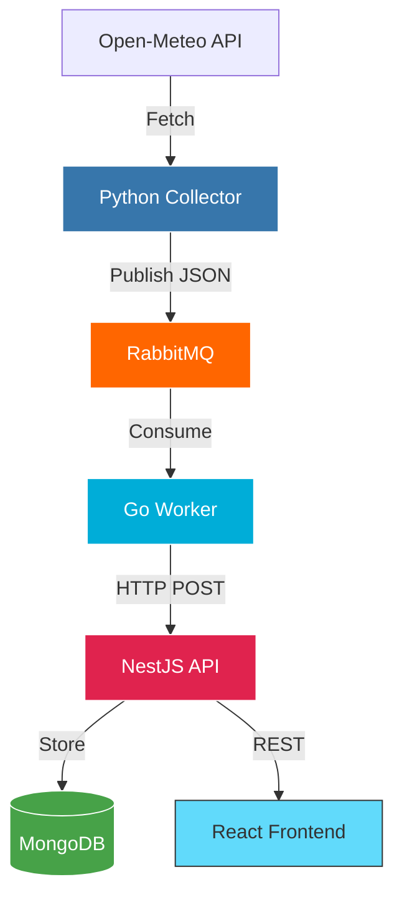
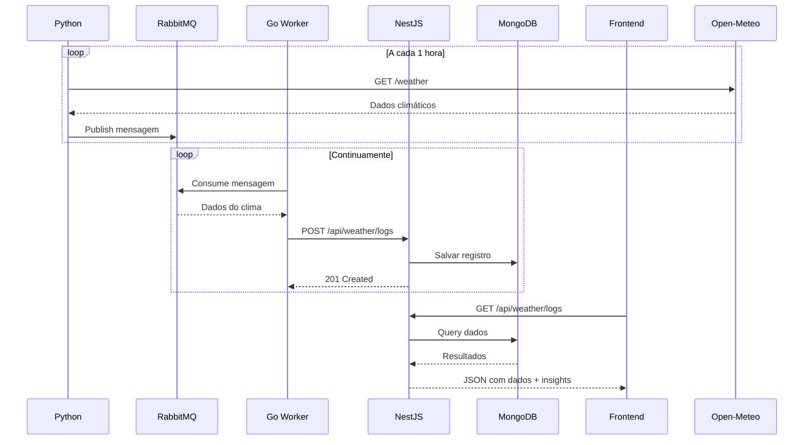

## 🏗️ Arquitetura do Sistema

### 📊 Fluxo de Dados

## Backend (NestJS)

- ✅ Setup inicial + Docker
- ✅ Conexão MongoDB
- ✅ Endpoint POST /api/weather/logs (recebe do Go)
- ✅ Endpoint GET /api/weather/logs (lista dados)
- ✅ Auth JWT + usuário padrão
- ✅ CRUD usuários
- ✅ Exportação CSV/XLSX
- ✅ Insights de IA

## Go Worker

- ✅ Conexão RabbitMQ
- ✅Consumer da fila
- ✅ HTTP client para NestJS
- ✅ Retry logic
- ✅ Logs estruturados

## Python Collector

- ✅ Integração Open-Meteo
- ✅ Cron/scheduler
- ✅ Producer RabbitMQ
- ✅ Tratamento de erros

## Frontend (React)

- ✅ Setup Vite + Tailwind + shadcn
- [ ] Tela de login
- [ ] Dashboard com gráficos
- [ ] Tabela de dados + exportação
- [ ] CRUD usuários
- [ ] (Opcional) Página API pública

## Infra

- ✅ Docker Compose funcional
- ✅ .env configurável
- [ ] README completo
